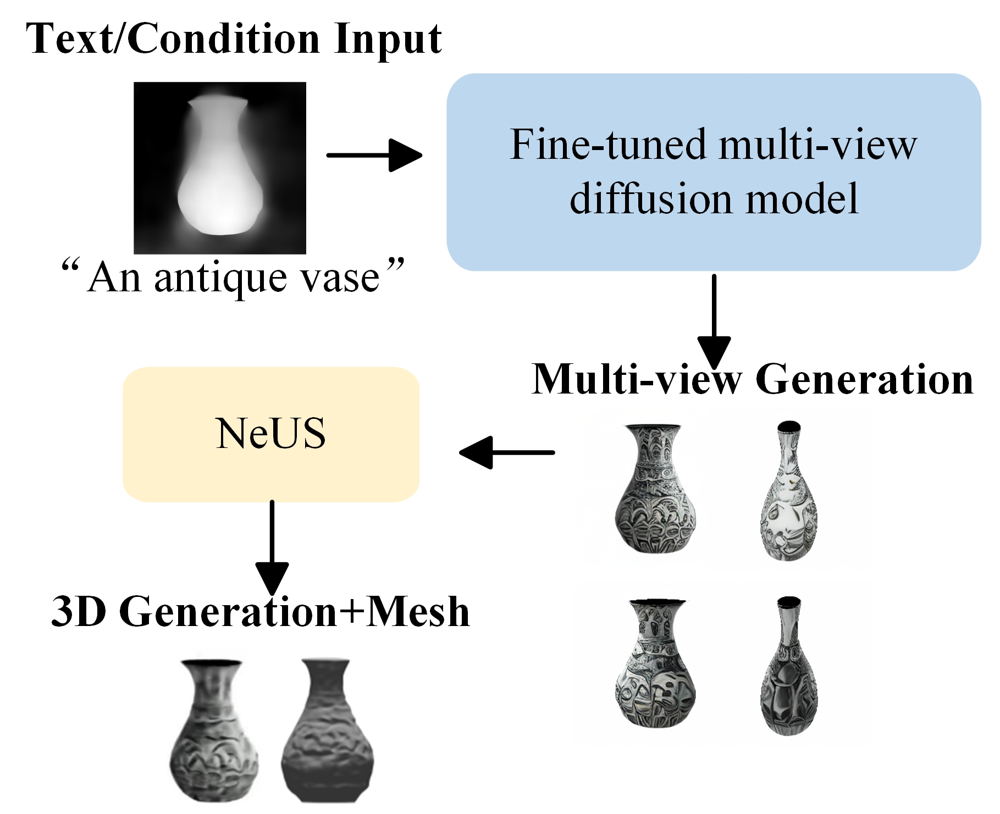

<h1 align="center">Text-to-3D Object Generation Methods Guided by Sketches and Depth Maps</h1>

<p align="center">
Jia Liu, Zihan Pan, Dapeng Chen, Lina Wei, and Aiguo Song<br>
Nanjing University of Information Science & Technology
</p>

---
<h2 align="center">ABSTRACT</h2>
To address the geometric randomness bias and multi-view inconsistency issues caused by semantic abstraction in the task of text-to-3D object generation, we propose a 3D object generation framework guided by both sketches and depth maps, aiming to achieve high-fidelity and high-efficiency 3D modeling through structured prior constraints. The proposed method is implemented via a three-step core process. First, a conditional adapter module is designed, encoding the sketch outline and depth space layout as multi-scale features, and performing cross-modal fusion with text semantics to impose geometric constraints. Second, a multi-view diffusion model is constructed, generating 16 geometrically consistent perspective images simultaneously through a cross-view 3D attention mechanism, and jointly optimizing the topological relationships between views to suppress component misalignment. Finally, combining Neural Radiance Field (NeRF) and hash grid coding technology, high-fidelity meshes are extracted from the multi-view images using a smooth loss function and gradient-aware optimization strategy. Experimental studies are conducted using the COCO-17 and LAION-AESTHETICS datasets, and the results are compared with baseline methods such as Shap-E and Zero-1-to-3. Experimental results show that the proposed method significantly outperforms others in terms of CLIP similarity, Frechet Inception Distance (FID), and other metrics, achieving over 60% higher generation efficiency than Score Distillation Sampling (SDS)-based optimization methods. A user study further confirms the comprehensive advantages of the proposed method in geometric consistency (36% vote share) and mesh fidelity (59% vote share). 
---
<h1 align="center">Overall working frame diagram</h1>
Our approach uses a two-stage 3D generative framework. The first stage is to generate an image with a text combined with sketches and depth maps, which is achieved through a fine-tuned diffusion model and conditional adapters. This is followed by the 3D stage of image generation, which is generated using the Neus algorithm to obtain the rendered video and mesh  
<p align="center">
  
</p>


## Install
Install packages in requirments.txt,We trained the model on a single 4090 gpu with 11.8 CUDA,We recommend using a Linux server for reproduction  
```bash
conda create -n <environment name>
conda activate <environment name>
pip install -r requirments.txt
```

Install tiny-cuda-nn
```bash
git+https://github.com/NVlabs/tiny-cuda-nn/#subdirectory=bindings/torch
```
Install CLIP
```bash
git+https://github.com/openai/CLIP.git
```
Download checkpoints [here](https://pan.baidu.com/s/1SZ51OcqDAk68VJOPMnZ_gQ) 
## RUN
1.Place the downloaded checkpoint in the corresponding folder
```bash
pzh3d
|-- ckpt
    |-- ViT-L-14.ckpt
    |-- pzh3d-pretrain.ckpt
|-- models
    |-- pzhadapter_sketch_sd15v2.pth
    |-- sd-v1-4.ckpt
```
2.Combine sketches with text to generate images
```bash
python test_adapter.py --which_cond sketch --cond_path examples/sketch/sofa3.png --cond_inp_type sketch --prompt "A purple sofa." --sd_ckpt models/sd-v1-4.ckpt --resize_short_edge 512 --cond_tau 0.8 --cond_weight 0.8 --n_samples 5 --adapter_ckpt models/t2iadapter_sketch_sd15v2.pth
```
3.3D generation
```bash
3.1 Generate multi-view images
python generate.py --ckpt ckpt/syncdreamer-pretrain.ckpt --input testset/sofa3.png --output output/sofa3 --sample_num 4 --cfg_scale 1.5 --elevation 30 --crop_size 200
3.2 Use the Nues algorithm to generate rendered videos as well as meshes
python train_renderer.py -i output/sofa3/0.png -n sofa3-neus -b configs/neus.yaml -l output/renderer 
```
## Results


